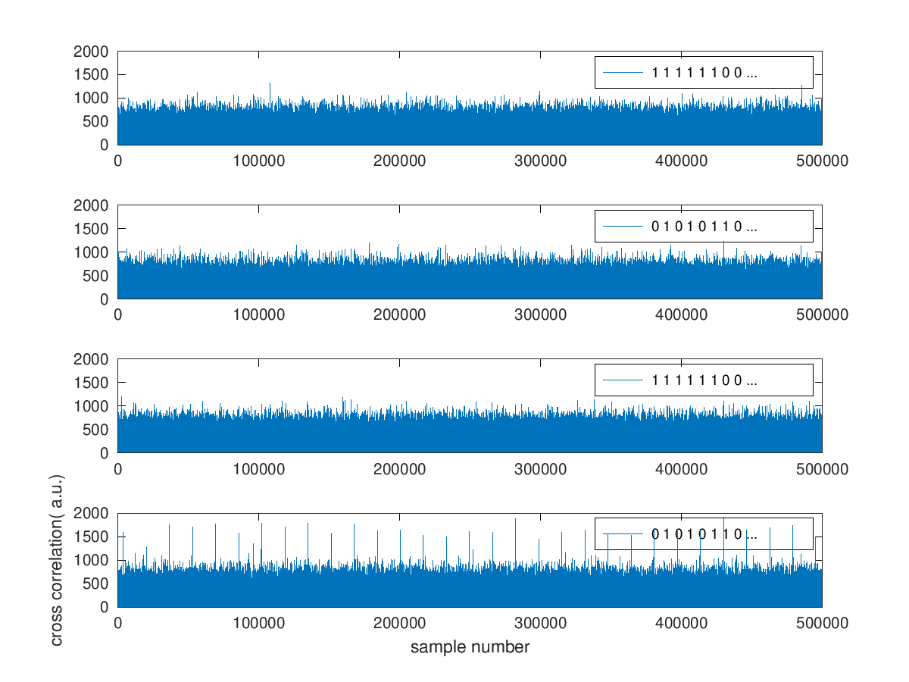

# meteor-m2
Meteor-M2 signal analysis: supporting material to http://jmfriedt.free.fr/glmf_meteor_eng.pdf presented at FOSDEM2019. All development completed on Debian GNU/Linux, compilation using ``gcc``
and signal processing using ``GNU/Octave``.

extrait.s is a sample data acquisition: soft bits encoded as signed 8-bit integers (char)

``go_viterbi1.m`` (GNU/Octave) will search for all possible permutation of the header bits to identify the QPSK phase rotation in the dataset

The output should look like

with correlation peaks every 16384 samples for one of the constellation 
rotation/permutation state.

``go_viterbi2.m`` aims at demonstrating how the synchronization header is encoded (demonstrated with some dummy sentence to justify the correlation word used in go_viterbi1.m)

viterbi.m convolutional encoding decoder taken from https://github.com/Filios92/Viterbi-Decoder/blob/master/viterbi.m

Various C programs linking with KA9Q's libfec library at https://github.com/quiet/libfec.git
are used to demonstrate functionalities with increasing complexity:
* ``1jmf_simplest.c``: decoding the synchronization word (manually encoded) to demonstrate
how to use Vitervi decoding
* ``2jmf_libfec_long.c``: same as 1. but on the sample file, reading the whole file at once and
the processing the whole dataset at once. Notice the dynamic memory allocation (malloc) since
a static memory allocation would not fit on the Linux stack.
* ``3jmf_libfec_blocks.c``: same as 2. but reading successive blocks from file rather than
the whole dataset at once
* ``4jmf_rs.c``: getting familiary with Reed Solomon error correction on synthetic data with the
introduction of a known number of errors at known positions
* ``5jmf_libfec_blocks_rs.c``: complete decoding using Viterbi for convolutional code removal and
Reed Solomon for error correction.

Once convolutional code decoding has been completed and optionally Reed Solomon correction applied,
``go_viterbi6.m`` aims at decoding sentences within each message block.
